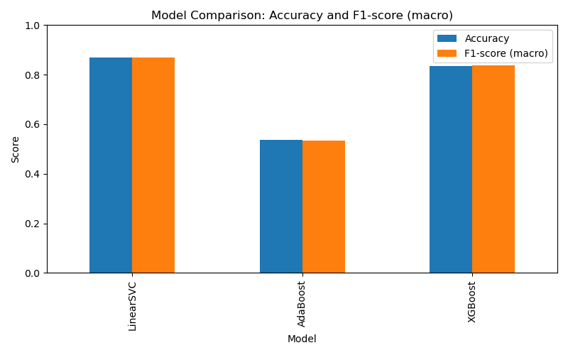

# News Category Text Classification with N-grams

This project demonstrates text classification of news articles using bag-of-words and n-grams, with preprocessing powered by NLTK and model comparison across LinearSVC, AdaBoost, and XGBoost.

## Motivation

I wanted to explore how different machine learning models perform on news category classification using n-gram features, and to practice robust NLP preprocessing with NLTK.

## Features

- Text preprocessing: tokenization, stop word removal, lemmatization (NLTK)
- Feature extraction: Bag-of-words and n-grams (scikit-learn)
- Models: LinearSVC, AdaBoost, XGBoost
- Evaluation: Classification report, confusion matrix, model comparison
- Visualizations: Class distribution, confusion matrices, model comparison plot
- Check out /pictures/ folder for all pictures mentioned and showed
- Check out /report/ folder for all classification reports for each model

## Dataset

- Download the dataset from [Kaggle: News Category Classifier](https://www.kaggle.com/code/hengzheng/news-category-classifier-val-acc-0-65)
- Place the `news_dataset.json` file in this directory. The file must have at least `text` and `category` fields.

## Setup

```bash
pip install scikit-learn nltk pandas matplotlib seaborn xgboost
python -m nltk.downloader punkt stopwords wordnet
```

## Usage

-Clone repository:
```bash
git clone "https://github.com/Ivan-Koptiev/ngram-text_classification"
```

-Run:
```bash
python ngram_text_classification.py
```

## Outputs

- `pictures/original_class_distribution.png`: Shows the distribution of news categories before balancing.
- `pictures/LinearSVC_confusion_matrix.png`, `pictures/AdaBoost_confusion_matrix.png`, `pictures/XGBoost_confusion_matrix.png`: Confusion matrices for each model.
- `reports/LinearSVC_classification_report.json`, `reports/AdaBoost_classification_report.json`, `reports/XGBoost_classification_report.json`: Detailed classification metrics for each model.
- `pictures/model_comparison.png`: Bar plot comparing accuracy and macro F1-score for all models.

## Results and Analysis

### Model Performance Comparison

After running the experiment with balanced datasets across four news categories (BUSINESS, SPORTS, CRIME, SCIENCE), here are the key findings:

**Overall Performance Rankings:**
1. **LinearSVC**: 86.88% accuracy, 86.90% macro F1-score
2. **XGBoost**: 83.62% accuracy, 83.66% macro F1-score  
3. **AdaBoost**: 53.67% accuracy, 53.41% macro F1-score

**Key Insights:**

**LinearSVC emerged as the clear winner** with the highest accuracy and F1-score. This suggests that for this particular text classification task with n-gram features, a linear model with support vector classification performs exceptionally well. The model shows balanced performance across all categories with precision and recall values consistently above 83% and overall accuracy of 86.88.

**XGBoost performed well** as the second-best model, achieving 83.62% accuracy. It shows good generalization but slightly lower performance than LinearSVC, which might indicate that the linear decision boundary is more suitable for this n-gram feature space.

**AdaBoost struggled significantly** with only 53.67% accuracy. This poor performance suggests that AdaBoost may not be well-suited for high-dimensional text classification tasks with n-gram features, possibly due to overfitting or the nature of the feature space.

### Category-Specific Analysis

**BUSINESS**: All models show good precision (>79%) but varying recall. LinearSVC achieved the best balance with 83.4% precision and 83.4% recall.

**SPORTS**: LinearSVC excelled here with 92.2% precision and 85.5% recall, while AdaBoost showed the highest recall (96.7%) but very low precision (36.0%), indicating many false positives.

**CRIME**: Consistently good performance across models, with LinearSVC achieving 89.2% precision and 89.9% recall, suggesting this category has distinctive vocabulary patterns.

**SCIENCE**: LinearSVC performed best with 83.1% precision and 88.8% recall, while AdaBoost struggled with only 37.0% recall despite 89.5% precision.

### Dataset Balancing Impact

The original class distribution visualization shows the dataset was imbalanced before processing. The balancing step was crucial for fair model comparison, ensuring each category had equal representation in the training and testing sets.

## What I Learned

- How to preprocess text data using NLTK (tokenization, stopword removal, lemmatization)
- The impact of n-gram features on text classification
- How to compare multiple machine learning models on the same NLP task
- The importance of visualizing results for model comparison
- Linear models can outperform ensemble methods for certain text classification tasks
- The critical importance of dataset balancing for fair model evaluation

## Challenges

- Balancing the dataset for fair model comparison
- Ensuring NLTK resources are available for preprocessing
- Handling the high dimensionality of n-gram features
- Understanding why AdaBoost performed poorly on this specific task

## Visualizations

**Class Distribution:**


**Confusion Matrices:**

LinearSVC:


AdaBoost:


XGBoost:


**Model Comparison:**



## License

MIT
